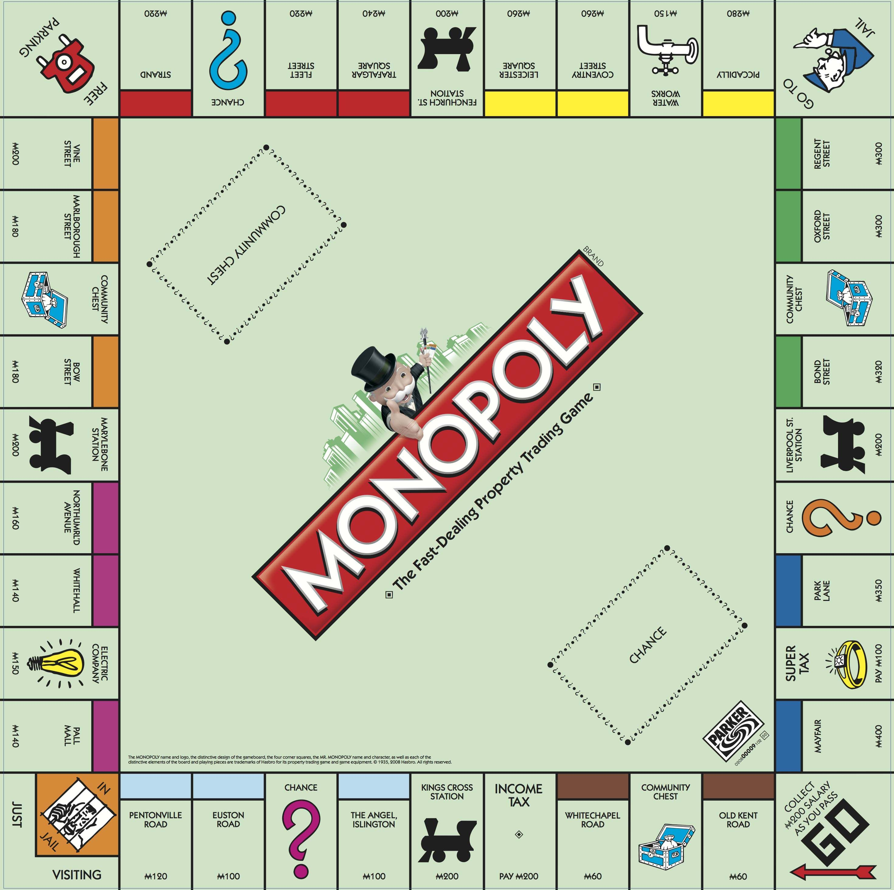

# Monopoly

## Refactor

- Square -> Space

### Constraints:

- 3 dice,
- Pieces
  - car, iron, lantern, thimble, shoe, top-hat, rocking horse, battleship and cannon
- 32 houses
- 12 hotels
- Chance and Community Chest Cards
- Title Deed cards
- Play money and a Banker's tray

## Classic Monopoly Rules

### Objective

Each player chooses one token to represent him/her while traveling around the board.

The object of the game is to become the wealthiest player through buying, renting and selling property.

Each player chooses one token to represent him/her while traveling around the board.

### Banker

The bank / auctioneer is controlled by the computer.

Besides the Bank’s money, the Bank holds the Title Deed cards and houses and hotels prior to purchase and use by the players.

The Bank pays salaries and bonuses to players

The bank sells and auctions properties and hands out their proper Title Deed cards

The bank sells houses and hotels to the players and The bank loans money when required on mortgages.

The Bank collects all taxes, fines, loans and interest, and the price of all properties which it sells and auctions.

- The Bank collects taxes from player.
- The Bank collects fines from player

The Bank never "goes broke." If the Bank runs out of money, the Banker may issue as much more as needed by writing on any ordinary paper.

### Play

#### Before start

Place player token on the square marked "GO"

Players sit in a circle around the board and each player in turn throws the dice. The player with the highest total starts the play.

#### Start

1. throw the dice and move your token in the direction of the arrow the number of spaces indicated by the dice. For the very first move of the game, you can can read the current_die value as the throw already happened before start.
2. After you have completed your play, the turn passes to the player on your the left (clockwise). The tokens remain on the spaces occupied and proceed from that point on.
3. Two or more tokens may rest on the same space at the same time.

According to the space your token reaches, you may be entitled to buy real estate or other properties — or obliged to pay rent, pay taxes, draw a Chance or Community Chest card, "Go to Jail," etc.

#### Doubles
If you throw doubles, you move your token as usual, the sum of the two dice, and are subject to any privileges or penalties pertaining to the space on which you land.

Retaining the dice, throw again and move your token as before.

If you throw doubles three times in succession,
move your token immediately to the space marked "In Jail"

#### GO
  
Each time a player's token lands on or passes over GO, whether by throwing the dice or drawing a card, the Banker pays him/her a $200 salary.

The $200 is paid only once each time around the board. However, if a player passing GO on the throw of the dice lands 2 spaces beyond it on Community Chest, or 7 spaces beyond it on Chance, and draws the "Advance to GO" card, he/she collects $200 for passing GO the first time and another $200 for "Advance to GO" reaching it the second time by instructions on the card.

#### Buying Property

Whenever you land on an unowned property you may buy that property from the Bank at its printed price. You receive the Title Deed card showing ownership; place it faceup in front of you.

If you do not wish to buy the property, the Banker sells property at auction to the highest bidder.

The buyer pays the Bank the amount of the bid in cash and receives the Title Deed card for that property.

Any player, including the one who declined the option to buy it at the printed price, may bid. Bidding may start at any price.

#### Paying Rent

When you land on property owned by another player, the owner collects rent from you in accordance with the list printed on its Title Deed card.

If the property is mortgaged, no rent can be collected. When a property is mortgaged, its Title Deed card is placed facedown in front of the owner.

It is advantage to hold all the Title Deed cards in a color group (eg. Boardwalk and Park Place; or Connecticut, Vermont and Oriental Avenues) because the owner may then charge double rent for unimproved properties in that color-group.

This rule applies to unmortgaged properties even if another property in that color-group is mortgaged.

It is even more advantageous to have houses or hotels on properties because rents are much higher than for unimproved properties.

The owner may not collect the rent if he/she fails to ask for it before the second player following throws the dice.

#### Chance and Community Chest

When you land on either of these spaces, take the top card from the deck indicated, follow the instructions and return the card face down to the bottom of the deck.

The "Get Out of Jail Free" card is held until used and then returned to the bottom of the deck. If the player who draws it does not wish to use it, he/she may sell it, at any time, to another player at an agreed price agreeable to both.

#### Income Tax

If you land on income tax you have two options: You may estimate your tax at $200 and pay the Bank, or you may pay 10% of your total worth to the Bank. Your total worth is all your cash on hand, printed prices of mortgaged and unmortgaged properties and cost price of all buildings you own.

You must decide which option you will take before you add up your total worth.

#### Super/Luxury Tax

If you land on super tax you then you have to pay $100 super tax to the Bank.

#### Jail

You land in Jail when...
- (1) your token lands on the space marked "Go to Jail"; 
- (2) you draw a card marked "Go to Jail"; or
- (3) you throw doubles three times in succession.

When you are sent to Jail you cannot collect your $200 salary in that move since, regardless of where your token is on the board, you must move it a directly into Jail. Your turn ends when you are sent to Jail.

If you are not "sent" to Jail but in the ordinary course of play land on that space, you are "Just Visiting," you incur no penalty, and you move ahead in the usual manner on your next turn.

Am I currently in jail

You get out of Jail by...

- (1) throwing doubles on any of your next three turns; if you succeed in doing this you immediately move forward the number of spaces shown by your doubles throw: even though you had thrown doubles, you do not take another turn;
- (2) using the "Get Out of Jail Free" card if you have it; 
- (3) purchasing the "Get Out of Jail Free" card from another player and playing it; 
- (4) paying a fine of $50 before you roll the dice on either of your next two turns.

If you do not throw doubles by your third turn, you must pay the $50 fine. You then get out of Jail and immediately move forward the number of spaces shown by your throw.

Even though you are in Jail, you may buy and sell property, buy and sell houses and hotels and collect rents.

#### Free Parking

A player landing on this place does not receive any money, property or reward of any kind. This is just a "free" resting place.

Alternative Rules: Fines go here and are picked up by who ever lands here

#### Houses

When you own all the properties in a color-group you may buy houses from the Bank and erect them on those properties.

If you buy one house, you may put it on any one of those properties. The next house you buy must be erected on one of the unimproved properties of this or any other complete color-group you may own.

The price you must pay the Bank for each house is shown on your Title Deed card for the property on which you erect the house.

The owner still collects double rent from an opponent who lands on the unimproved properties of his/her complete color-group.

Following the above rules, you may buy and erect at any time as many houses as your judgement and financial standing will allow. But you must build evenly, ie., you cannot erect more than one house on any one property of any color-group until you have built one house on every property of that group.

You may then begin on the second row of houses, and so on, up to a limit of four houses to a property.

For example, you cannot build three houses on one property if you have only one house on another property of that group.

As you build evenly, you must also break down evenly if you sell houses back to the Bank (see SELLING PROPERTY).

#### Hotels

When a player has four houses on each property of a complete color-group, he/she may buy a hotel from the Bank and erect it on any property of the color-group. He/she returns the four houses from that property to the Bank and pays the price for the hotel as shown
on the Title Deed card. Only one hotel may be erected on any one property.

#### Building Shortages

When the Bank has no houses to sell, players wishing to build must wait for some player to return or sell his/her houses to the Bank before building. If there are a limited number of houses and hotels available and two or more players wish to buy more than the Bank has, the houses or hotels must be sold at auction to the highest bidder.

 
#### Sell Property

Unimproved properties, railroads and utilities (out not buildings) may be sold to any player as a private transaction for any amount the owner can get; however, no property can be sold to another player if buildings are standing on any properties of that color-group. Any buildings so located must be sold back to the Bank before the owner can sell any property of that color-group.

Houses and hotels may be sold back to the Bank at any time for one-half the price paid for them.

All houses on one color-group must be sold one by one, evenly, in reverse of the manner in which they were erected,

All hotels on one color group may be sold at once, or they may be sold one hotel at a time (one hotel equals five houses), evenly, in reverse of the manner in which they were erected.

#### Mortgages

Unimproved properties can be mortgaged through the Bank at any time. Before an improved property can be mortgaged, all the buildings on all the properties of its color-group must be sold back to the Bank at half price. The mortgage value is printed on each Title Deed card.

No rent can be collected on mortgaged properties or utilities, but rent can be collected on unmortgaged properties in the same group.

In order to lift the mortgage, the owner must pay the Bank the amount of the mortgage plus 10% interest. When all the properties of a color-group are no longer mortgaged, the owner may begin to buy back houses at full price.

The player who mortgages property retains possession of it and no other player may secure it by lifting the mortgage from the Bank.
However, the owner may sell this mortgaged property to another player at any agreed price. If you are the new owner, you may lift the mortgage at once if you wish by paying off the mortgage plus 10% interest to the Bank. If the mortgage is not lifted at once, you must pay the Bank 10% interest when you buy the property and if you lift the mortgage later you must pay the Bank an additional 10% interest as well as the amount of the mortgage.

 
#### Bankruptcy

You are declared bankrupt if you owe more than you can pay either to another player or to the Bank. If your debt is to another player, you must turn over to that player all that you have of value and retire from the game. In making this settlement, if you own houses or hotels, you must return these to the Bank in exchange for money to the extent of one-half the amount paid for them; this cash is given to the creditor. If you have mortgaged property you also tum this property over to your creditor but the new owner must at once pay the Bank the amount of interest on the loan, which is 10% of the value of the property. The new owner who does this may then, at his/her option, pay the principal or hold the property until some later turn, then lift the mortgage. If he/she holds property in this way until a later turn, he/she must pay the interest again upon lifting the mortgage.

Should you owe the Bank, instead of another player, more than you can pay (because of taxes or penalties) even by selling off buildings
and mortgaging property, you must tum over all assets to the Bank. In this case, the Bank immediately sells oy auction all property so taken, except buildings. A bankrupt player must immediately retire from the game. The last player left in the game wins.

#### Miscellaneous

Money can be loaned to a player only by the Bank and then only by mortgaging property. No player may borrow from or lend money to another player.

## Chance Cards   

Traditionally, the question marks placed on the Chance spaces around the board are pink, blue, and red, in that order.

### Simple collection of chance cards

- 1 x Advance to "Go", collect $200.
- 1 x Advance to Trafalgar Square If you pass Go, collect $200.
- 1 x Advance to Pall Mall If you pass Go, collect $200.
- 1 x Advance token to the nearest Utility. If unowned, you may buy it from the Bank. If owned, throw dice and pay owner a total 10 (ten) times the amount thrown.
- 2 x Advance to the nearest Railroad. If unowned, you may buy it from the Bank. If owned, pay owner twice the retail to which they are otherwise entitled. If Railroad is unowned, you may buy it from the Bank.
- 1 x Bank pays you dividend of $50.
- 1 x Get out of Jail Free. This card may be kept until needed, or traded/sold.
- 1 x Go Back Three Spaces.
- 1 x Go to Jail. Go directly to Jail. Do not pass GO, do not collect $200.
- 1 x Make general repairs on all your property: For each house pay $25, For each hotel pay $100.
- 1 x Pay poor ta x  of $15
- 1 x Take a ride to King’s Cross Station If you pass Go, collect $200.
- 1 x Take a walk on the board walk. Advance token to Mayfair.
- 1 x You have been elected Chairman of the Board. Pay each player $50.
- 1 x Your building and loan matures. Collect $150.
- 1 x You have won a crossword competition. Collect $100.

### Simple collection of community chest cards

- 1 x Advance to "Go". Collect $200.
- 1 x Bank error in your favor. Collect $200.
- 1 x Doctor's fees. Pay $50.
- 1 x From sale of stock you get $50.
- 1 x Get Out of Jail Free. This card may be kept until needed or sold/traded.
- 1 x Go to Jail. Go directly to jail. Do not pass Go, Do not collect $200.
- 1 x Grand Opera Night. Collect $50 from every player for opening night seats.
- 1 x Holiday Fund matures. Collect $100.
- 1 x Income tax refund. Collect $20.
- 1 x It's your birthday. Collect $10 from every player.
- 1 x Life insurance matures – Collect $100.
- 1 x Hospital Fees. Pay $50.
- 1 x School fees. Pay $50.
- 1 x Receive $25 consultancy fee.
- 1 x You are assessed for street repairs: Pay $40 per house and $115 per hotel you own.
- 1 x You have won second prize in a beauty contest. Collect $10.
- 1 x You inherit $100.

### Monopoly Chance And Community Chest Cards, Ranked

You have won second prize in a beauty contest collect $10
Grand opera opening collect $50 from every player
GO TO JAIL GO DIRECTLY TO JAIL DO NOT PASS GO DO NOT COLLECT $200
Advance to Illinois Ave.
Bank error in your favor collect $200
Advance to GO (Collect $200)
Xmas fund matures collect $100
Your building and loan matures collect $150
Take a ride on the Reading. If you pass GO collect $200
You inherit $100
Life insurance matures collect $100
Go back three spaces
Advance token to Boardwalk
Bank pays you dividend of $50
Income tax refund collect $20
From sale of stock you get $45
Pay poor tax of $15
Get out of jail free
Receive for services $25
Doctor’s fee pay $50
Advance token to the nearest railroad and pay the owner twice the rental to which he/she is otherwise entitled. If railroad is UNOWNED you may buy it from the bank
Advance to St. Charles Place. If you pass GO, collect $200
Advance token to the nearest utility. If unowned you may buy it from the bank. If owned, throw dice and pay the owner a total ten times the amount shown
Pay school tax of $150
Pay hospital $100
You have been elected chairman of the board. Pay each player $50
Death by dismemberment
Make general repairs on your property. For each house pay $25 for each hotel $100
You are assessed for street repairs $40 per house $115 per hotel

